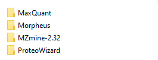
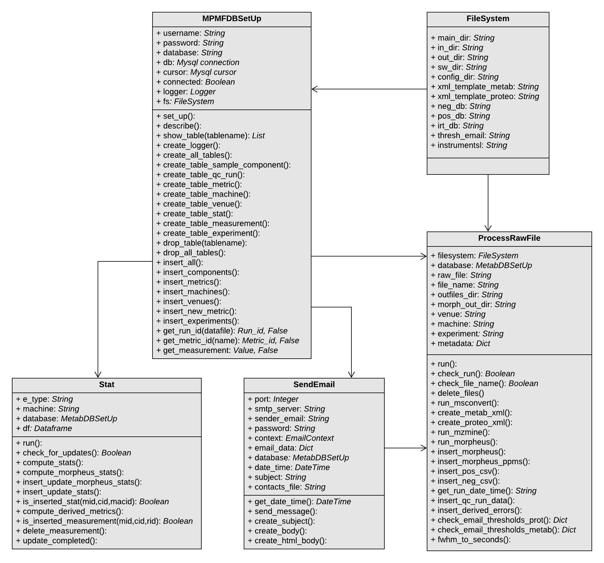
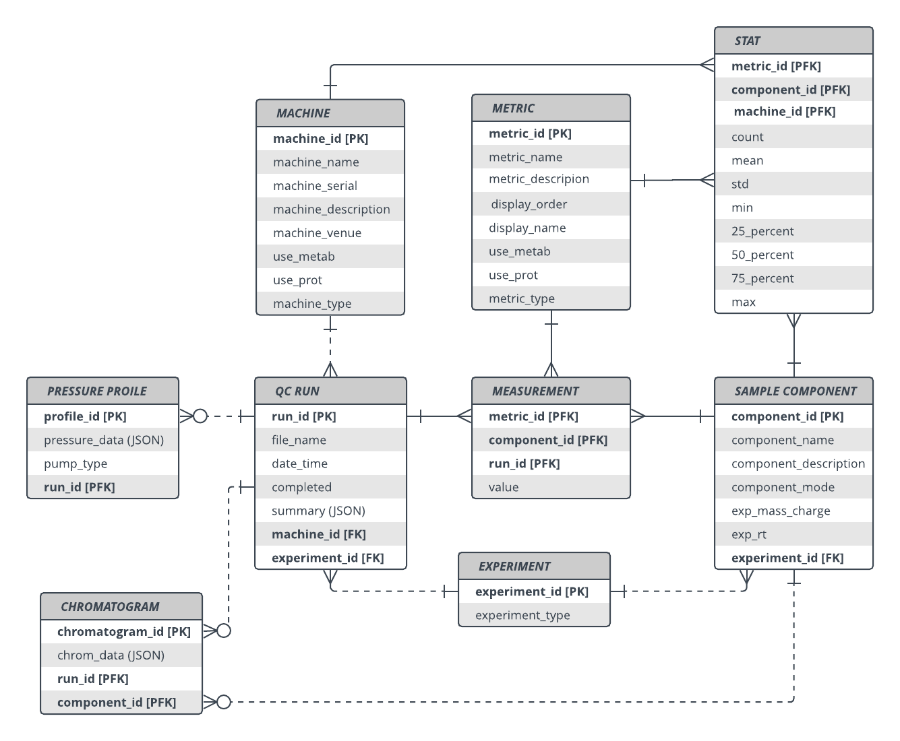

# MPMF Quality Control Processing

This is the GitLab repo for the MPMF QC processing pipeline.  

### To Use
* _MPMF_Database_SetUp_ will create a database to store the processed data.  
It is recommended to process at least 20 raw files before loading the server as some charts rely on history data.  
A MySQL database is required. Add your mysql password and username to the script of _MPMF_Database_SetUp_.    
Also provided is an example dataset as a mysql dump file that can be used with the example configuration files to test the system.  
https://drive.google.com/file/d/1FUuoP6_HFlYU9xG2zz7K2Y4ZPGfKikdw/view?usp=sharing 
* _MPMF_Process_Raw_Files_ can be used to process a batch of raw files for proteomics or metabolomics.  
To run this file, input the raw file directory as first argument, then the output directory, venue name,  and experiment type eg.  
_python MPMF_Process_Raw_Files.py "Z:\Metabolomics\QC_runs\C1_Clayton" "Z:\OutFiles" "clayton" "proteomics"_  

### Configuration and Software
* The Config directory shows the required set-up and processing files that are needed  
* The open source software needed for processing needs to be installed in a Software directory as shown  

### Class Diagram

### ER Diagram

